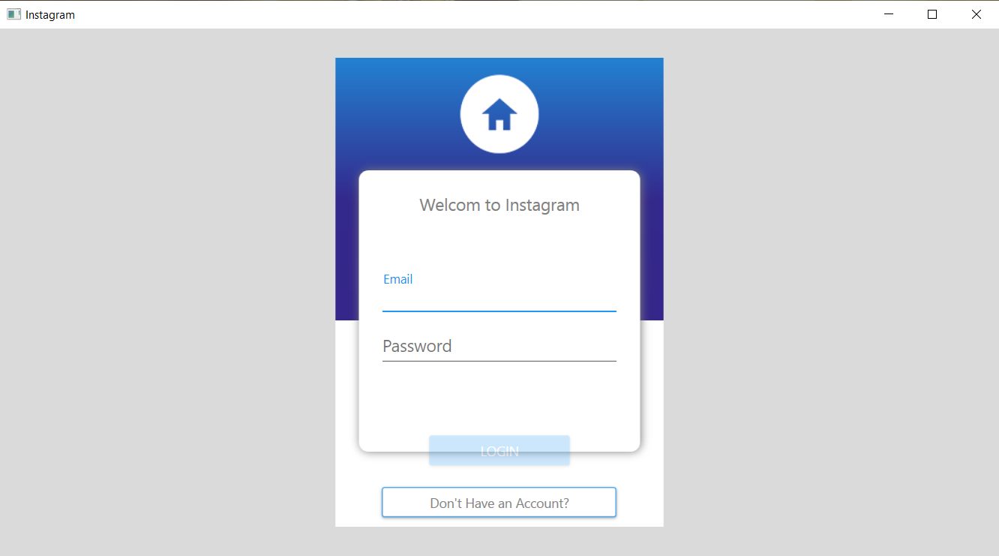
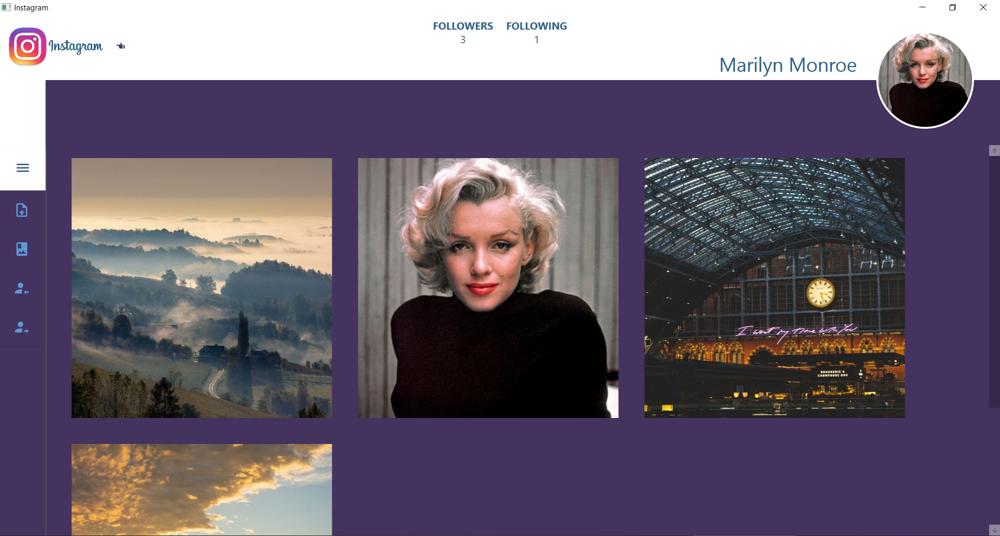
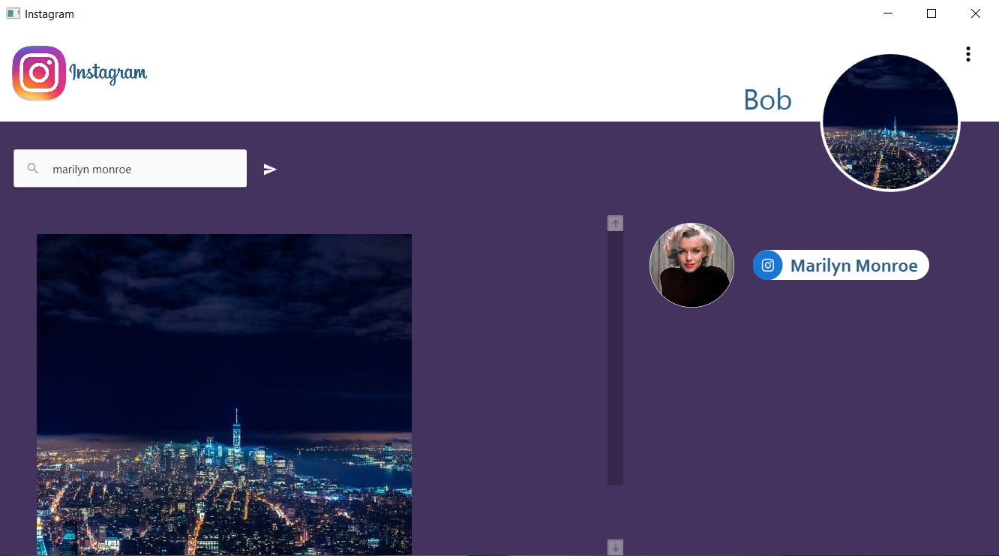

<h1 align="center">Instagram</h1>

<p align="center">


</p>

## About The Project

_The application was created for [Programming IV](https://www.wbmii.ath.bielsko.pl) classes.
The project implements Dependency Injection and MVVM patterns._ 

<br/>







## Features

* Registration
* Login
* Upload photos
* Profile page
* Subscription (follow / unfollow)
  
## Built With

* [.NET Core](https://docs.microsoft.com/en-us/dotnet/) 3.1.0
* [WPF](https://docs.microsoft.com/en-us/dotnet/framework/wpf/) .NET Framework 4.8 
* [ASP.NET Web API](https://docs.microsoft.com/en-us/aspnet/core/web-api/?view=aspnetcore-3.1)
* [Entity Framework](https://docs.microsoft.com/en-us/ef/)
* [MediatR](https://github.com/jbogard/MediatR/wiki)
* [Caliburn.Micro](https://caliburnmicro.com/)
* [Swagger](https://swagger.io/)
* [Cloudinary](https://cloudinary.com/)
* [Material Design](http://materialdesigninxaml.net/)

## Getting Started

### Prerequisites

* .NET Core 3.1.0
* .NET Framework 4.8
* SQL Server
* Cloudinary account

### Installation

1. Create an account on Cloudinary
2. In solution WebUI in `appsettings.json` set your Cloudinary account details and database connection string.
```JSON
"Cloudinary": {
    "CloudName": "ENTER YOUR ACCOUNT DETAIL",
    "ApiSecret": "ENTER YOUR ACCOUNT DETAIL",
    "ApiKey": "ENTER YOUR ACCOUNT DETAIL"
  }
```
```JSON
"ConnectionStrings": {
    "EfInstagramData": "ENTER YOUR CONNECTION STRING"
  },
```
3. Set multiple startup projects: WebUI and DesktopUI.
4. Build and run the solution.

## License

This project is licensed under the MIT License. 
