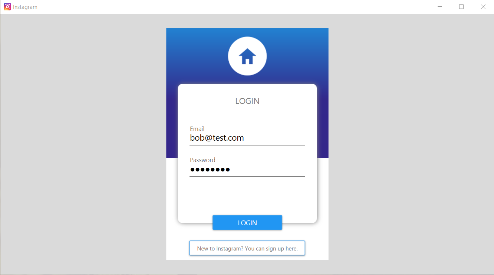

<h1 align="center">Instagram</h1>

<p align="center">


</p>

## About The Project

_The application was created for [Programming IV](https://www.wbmii.ath.bielsko.pl) classes.
The project implements Dependency Injection and MVVM patterns._
śś
<br/>

<p align="center">
  
</p>

<p align="center">
  
</p>

<p align="center">
  
</p>

## Features

- Registration
- Login
- Uploading photos to the cloud
- Profile page
- Subscription (follow / unfollow)

## Built With

| Server                                                                                       | Client                                        |
| -------------------------------------------------------------------------------------------- | --------------------------------------------- |
| [.NET Core](https://docs.microsoft.com/en-us/dotnet/) 3.1.0                                  | [WPF](https://docs.microsoft.com/en-us/dotnet/framework/wpf/) .NET Framework 4.8 |
| [ASP.NET Web API](https://docs.microsoft.com/en-us/aspnet/core/web-api/?view=aspnetcore-3.1) | [Caliburn.Micro](https://caliburnmicro.com/) |
| [Entity Framework](https://docs.microsoft.com/en-us/ef/)                                     | [Material Design](http://materialdesigninxaml.net/) |
| [MediatR](https://github.com/jbogard/MediatR/wiki)                                           |
| [AutoMapper](https://automapper.org/)                                                        |
| [Swagger](https://swagger.io/)                                                               |
| [Cloudinary](https://cloudinary.com/)                                                        |

## Getting Started

### Prerequisites

- .NET Core 3.1.0
- .NET Framework 4.8
- SQL Server
- Cloudinary account

### Installation

1. Create an account on Cloudinary.
2. In solution WebUI in `appsettings.json` set your Cloudinary account details and database connection string.

```JSON
"Cloudinary": {
    "CloudName": "ENTER YOUR ACCOUNT DETAIL",
    "ApiSecret": "ENTER YOUR ACCOUNT DETAIL",
    "ApiKey": "ENTER YOUR ACCOUNT DETAIL"
  }
```

```JSON
"ConnectionStrings": {
    "EFInstagramData": "ENTER YOUR CONNECTION STRING"
  },
```

3. Set multiple startup projects: WebUI and DesktopUI.
4. Build and run the solution.

## License

This project is licensed under the MIT License.

## Contact

**Krzysztof Talar** - [Linkedin](https://www.linkedin.com/in/ktalar/) - krzysztoftalar@protonmail.com
